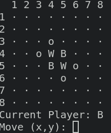
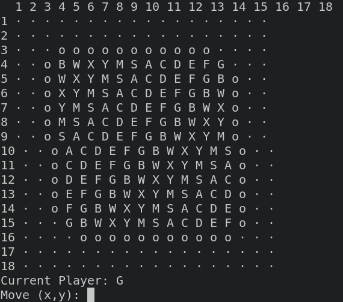

# Othello

A loose implementation of Othello made on stream at https://www.twitch.tv/peterboyer_!

Clone the repo, install deps with `yarn install` or `npm install`, the run with `yarn cli` or `npm run cli`.

Supports 2 players default.

Or you can provide N players (this is 12 here!)

